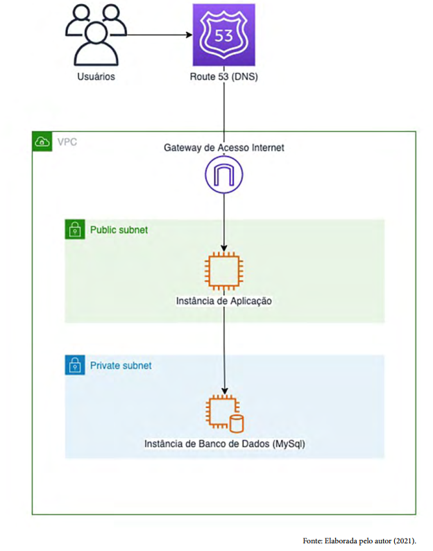

# Reconhecimento Facial e transformação de imagens em dados no AZURE

## Projeto

Este projeto está divido em um Readme com a descriçao do que foi aplicado. Em seguida, haverá uma pasta com as imagens usadas para processamento e por ultimo, uma pasta contendo os resultados ou saídas esperadas.

## Teste da imagem vpc-subnet-gateway.png



Como enviei a imagem

```curl
curl --location 'https://fasdf.cognitiveservices.azure.com/computervision/imageanalysis:analyze?features=denseCaptions%2Ccaption%2Cobjects&model-version=latest&api-version=2024-02-01' \
--header 'Ocp-Apim-Subscription-Key: 9******3' \
--header 'Content-Type: image/png' \
--data-binary '@.../Pictures/vpc-subnet-gateway.png'
```

### Descrição gerada

#### a screenshot of a computer
outros: a white square with orange lines, a purple sign with white text and numbers, 
```json
{"modelVersion":"2023-10-01","captionResult":{"text":"a screenshot of a computer","confidence":0.8482656478881836},"denseCaptionsResult":{"values":[{"text":"a screenshot of a computer","confidence":0.8477903008460999,"boundingBox":{"x":0,"y":0,"w":624,"h":794}},{"text":"a white square with orange lines","confidence":0.7144460082054138,"boundingBox":{"x":292,"y":360,"w":55,"h":54}},{"text":"a purple sign with white text and numbers","confidence":0.7023639678955078,"boundingBox":{"x":274,"y":2,"w":91,"h":89}}]},"metadata":{"width":624,"height":794},"objectsResult":{"values":[]}}
```

### Resultado

Não acredito que este endpoint possua um resultado satisfatório para o time de imagem que estou tentando encontrar a descrição.